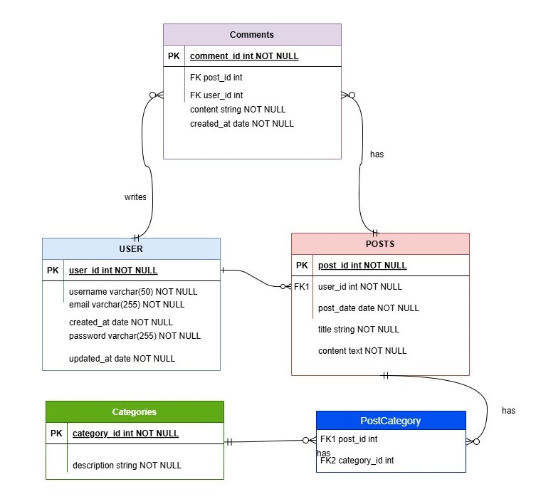

Blogging System with Sequelize
A simple and scalable blogging platform built using Node.js, Express, Sequelize, and MySQL. This project enables users to create, update, delete, and view blog posts. It also supports user authentication and categorization of posts.

Technologies Used
Node.js: JavaScript runtime for building the server-side application.
Express: A minimal and flexible Node.js web application framework.
Sequelize: Promise-based ORM for Node.js for interacting with MySQL database.
MySQL: Relational database for storing user and post data.
Jest: Testing framework for running unit and integration tests.
Docker: Containerization for easy development and deployment.
Database ERD

Example Routes
Below are some example routes that demonstrate how to interact with the blogging system.

1. Create a Post
Endpoint: POST /posts/createPost

Request body:

json
Copy code
{
  "title": "My First Post",
  "content": "This is the content of my first post.",
  "userId": 1,
}
Response:

json
Copy code
{
  "id": 1,
  "title": "My First Post",
  "content": "This is the content of my first post.",
  "userId": 1,
  "createdAt": "2024-11-08T10:00:00.000Z",
  "updatedAt": "2024-11-08T10:00:00.000Z"
}
2. Get All Posts
Endpoint: GET /posts/getAllPosts
Response:
json
Copy code
[
    {
        "id": 5,
        "title": "SQL",
        "content": "SQL is amazing",
        "userId": 3,
        "createdAt": "2024-11-08T09:14:38.000Z",
        "updatedAt": "2024-11-08T09:14:38.000Z",
        "user": {
            "id": 3,
            "username": "Faris",
            "email": "faris@gmail.com",
            "password": "$2b$10$KJ6qxcyNCmNv8RdJo5lXGuFptcmqb/zD0A5XkfIyhuoeHYIXTHkXK",
            "createdAt": "2024-11-08T09:11:54.000Z",
            "updatedAt": "2024-11-08T09:11:54.000Z"
        },
        "categories": [
            {
                "id": 3,
                "description": "testcategory",
                "createdAt": "2024-11-08T09:19:58.000Z",
                "updatedAt": "2024-11-08T09:19:58.000Z",
                "posts_categories": {
                    "postId": 5,
                    "categoryId": 3,
                    "createdAt": "2024-11-08T09:19:58.000Z",
                    "updatedAt": "2024-11-08T09:19:58.000Z"
                }
            },
        ],
        "comments": [
            {
                "id": 1,
                "content": "testcontent",
                "postId": 5,
                "userId": 3,
                "createdAt": "2024-11-08T09:17:31.000Z",
                "updatedAt": "2024-11-08T09:17:31.000Z"
            },
        ]
    },
    {
        "id": 8,
        "title": "SQL",
        "content": "SQL is amazing",
        "userId": 3,
        "createdAt": "2024-11-08T12:17:08.000Z",
        "updatedAt": "2024-11-08T12:17:08.000Z",
        "user": {
            "id": 3,
            "username": "Faris",
            "email": "faris@gmail.com",
            "password": "$2b$10$KJ6qxcyNCmNv8RdJo5lXGuFptcmqb/zD0A5XkfIyhuoeHYIXTHkXK",
            "createdAt": "2024-11-08T09:11:54.000Z",
            "updatedAt": "2024-11-08T09:11:54.000Z"
        },
        "categories": [],
        "comments": []
    }
]
3. Get a Post by ID
Endpoint: GET /posts/getPostById/:id
Response:
json
Copy code
{
    "id": 5,
    "title": "SQL",
    "content": "SQL is amazing",
    "userId": 3,
    "createdAt": "2024-11-08T09:14:38.000Z",
    "updatedAt": "2024-11-08T09:14:38.000Z",
    "user": {
        "id": 3,
        "username": "Faris",
        "email": "faris@gmail.com",
        "password": "$2b$10$KJ6qxcyNCmNv8RdJo5lXGuFptcmqb/zD0A5XkfIyhuoeHYIXTHkXK",
        "createdAt": "2024-11-08T09:11:54.000Z",
        "updatedAt": "2024-11-08T09:11:54.000Z"
    },
    "categories": [
        {
            "id": 3,
            "description": "testcategory",
            "createdAt": "2024-11-08T09:19:58.000Z",
            "updatedAt": "2024-11-08T09:19:58.000Z",
            "posts_categories": {
                "postId": 5,
                "categoryId": 3,
                "createdAt": "2024-11-08T09:19:58.000Z",
                "updatedAt": "2024-11-08T09:19:58.000Z"
            }
        },
    ],
    "comments": [
        {
            "id": 1,
            "content": "testcontent",
            "postId": 5,
            "userId": 3,
            "createdAt": "2024-11-08T09:17:31.000Z",
            "updatedAt": "2024-11-08T09:17:31.000Z"
        },   
    ]
}
4. Update a Post
Endpoint: PUT /posts/:id

Request body:

json
Copy code
{
  "title": "Updated Post Title",
  "content": "This is the updated content of the post."
}
Response:

json
Copy code
{
    "id": 5,
    "title": "Updated Post Title",
    "content": "This is the updated content of the post.",
    "userId": 3,
    "createdAt": "2024-11-08T09:14:38.000Z",
    "updatedAt": "2024-11-08T12:21:30.844Z"
}
5. Delete a Post
Endpoint: DELETE /posts/:id
Response:
json
Copy code
{
  "message": "Post deleted successfully"
}
Getting Started
To run this project locally, you need to have Docker and Node.js installed. Here are the steps to get started:

1. Clone the repository
bash
Copy code
git clone https://github.com/yourusername/blogging-system-sequelize.git
cd blogging-system-sequelize
2. Install dependencies
bash
Copy code
npm install
3. Set up the database
If you're using Docker, you can use docker-compose to set up the MySQL container. Make sure you have a docker-compose.yml file that defines the MySQL service, or use the following example:

yaml
Copy code
version: '3'
services:
  db:
    image: mysql:latest
    environment:
      MYSQL_ROOT_PASSWORD: rootpassword
      MYSQL_USER: user
      MYSQL_PASSWORD: password
      MYSQL_DATABASE: blogging_db
    ports:
      - "3306:3306"
Run the database container:

bash
Copy code
docker-compose up -d
4. Run the application
To start the application:

bash
Copy code
npm start
Your app will be running on http://localhost:3000.